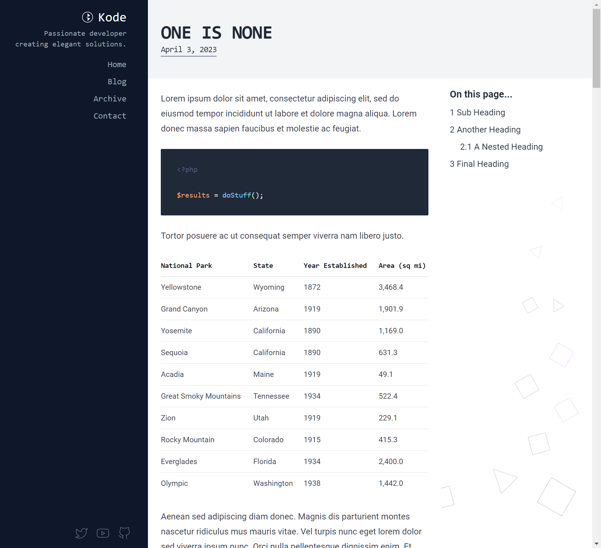

Kode is a free Statamic 3 website, intended for use as a single-author programming/technology blog.



## Sample Project Details

This sample project contains implementations for the following techniques:

* A custom `collection_archive` tag, which can be used to generate paginated, filtered, and sorted archives templates for Statamic collections;
* An implementation for generating a custom sitemap using basic PHP features;
* Examples of customizing Statamic's Markdown parser, with a basic implementation of [Mermaid](https://mermaid.js.org/), a JavaScript based diagramming and charting tool;
* Examples of utilizing event listeners to customize Statamic response output;
* Utilizing Laravel's translation system to customize template content;
* Includes full Antlers, JavaScript, and PHP source

## Installation

You will need to clone/download the archive of this repository before using it.

Once you have downloaded the sample project you will need install Statamic, the frontend dependencies and build the site's frontend assets.

To install Statamic and its dependencies, you may issue the following command from the root of your project:

```bash
composer install
```

Once you have cloned the project, you will need to install and build the front-end assets:

```bash
npm install && npm run dev
```

## Assets and Sample Images

* Sample images are from Unsplash: https://unsplash.com/
* Social media icons are from Feather: https://feathericons.com/
* 404 Page SVG is from https://freesvgillustration.com/product/404/

## License

"Kode" is free software released under the MIT License.

Feel free to use it as a starting point for a project, or take things from it. Redistribution as a Starter Kit is prohibited.
